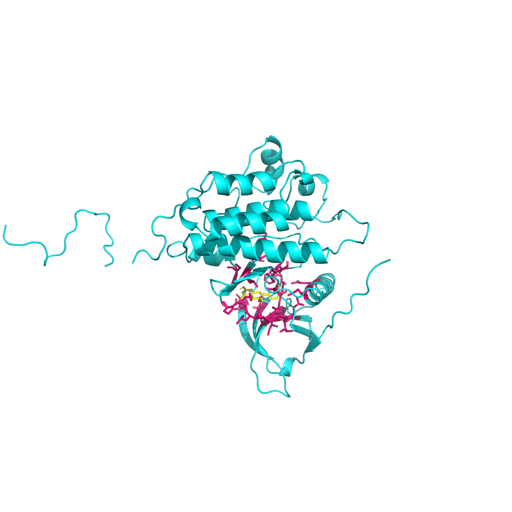

# egfr-docking-analysis
Molecular docking analysis of natural compounds against EGFR using AutoDock Vina computational tools.
# 🧬 Molecular Docking Analysis of Natural Compounds Against EGFR

---

## 📌 Overview

This project focuses on molecular docking analysis of selected bioactive compounds against the Epidermal Growth Factor Receptor (EGFR), a key target in cancer research.

The study aims to evaluate the interaction of natural compounds with EGFR using computational approaches.

---

## 🧪 Tools & Software

* AutoDock Vina
* PyMOL
* Open Babel
* Ubuntu (Linux environment)

---

## 🔬 Methodology

1. **Ligand Selection**

   * Quercetin
   * Luteolin
   * Remdesivir

2. **Protein Preparation**

   * EGFR structure (PDB ID: 1M17) obtained
   * Water molecules and existing ligands removed
   * Prepared using AutoDock Tools

3. **Ligand Preparation**

   * Structures downloaded from PubChem (3D conformer)
   * Converted from SDF → PDB → PDBQT using Open Babel

4. **Docking**

   * Performed using AutoDock Vina
   * Grid box centered at active site
   * Exhaustiveness: 8

---

## 📊 Results

| Ligand     | Binding Energy (kcal/mol) |
| ---------- | ------------------------- |
| Quercetin  | -8.882                    |
| Luteolin   | -8.738                    |
| Remdesivir | -8.058                    |

👉 Quercetin showed the most favorable docking score among the tested compounds.

---

## 🖼️ Visualization

  

  <em>Docked complex of quercetin with EGFR highlighting the interaction region</em>

---

## ⚠️ Limitations

* Docking results are computational predictions
* Experimental validation is required for confirmation

---

## 🚀 Future Scope

* Molecular dynamics simulations
* ADMET analysis
* Virtual screening of larger compound libraries

---

## 🔗 Author

Dimple Srivastava
MSc Biotechnology

---

## 🏷️ Tags

#Bioinformatics #MolecularDocking #ComputationalBiology #DrugDiscovery
